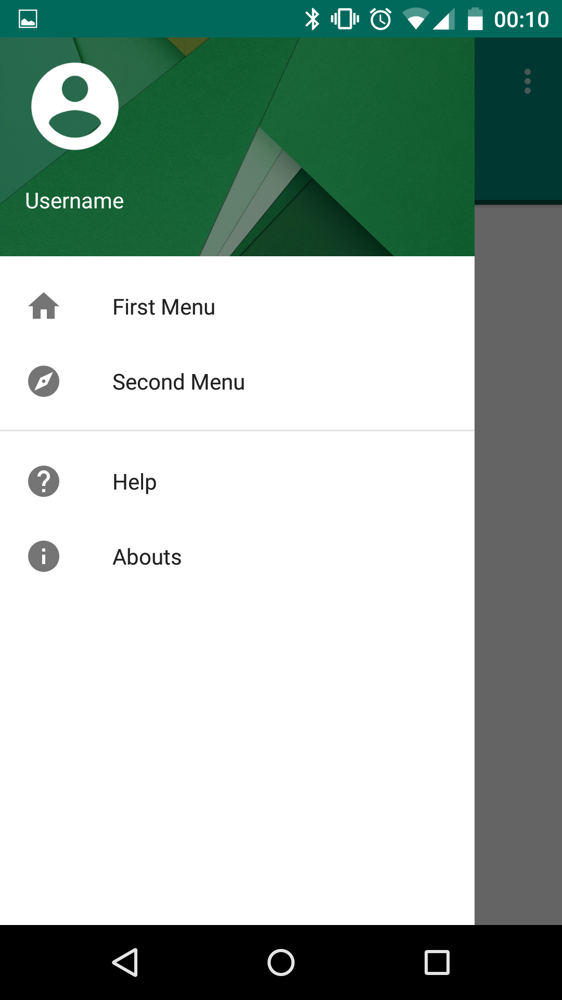

# Android-Sliding-Tabs-And-Navigation-Drawer-With-Material-Design

Google has been updating many of its apps with its new material design.
Some of the main visual changes un the update is the newely redesigned of sliding tabs and navigation drawer.
This is a sample application to learn how to mix together sliding tabs and navigation drawer in the same activity.

Main sources
--------------
- http://www.exoguru.com/android/material-design/navigation/android-sliding-tabs-with-material-design.html
- http://www.android4devs.com/2014/12/how-to-make-material-design-navigation-drawer.html
- https://medium.com/android-news/navigation-drawer-styling-according-material-design-5306190da08f

Demo
--------------

